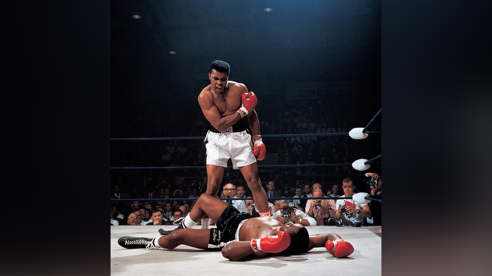

# Wallpaper Scaler

Scales an image up to your monitor's resolution, blurring the background if it
doesn't fully cover your monitor. I use it to make wallpapers out of album
covers, but it should work with any picture really.

Depends on Pillow, which can be installed by:

```
python3 -m pip install Pillow
```

## How to Use

Modify the `width` and `height` variables in the `wallpaper_scaler.py` to your
monitor's resolution.

`usage: wallpaper_scaler.py <image to make into wallpaper> [output file]`

## Example Input Image


## Generated Output Image


## Example #2


## Output #2


